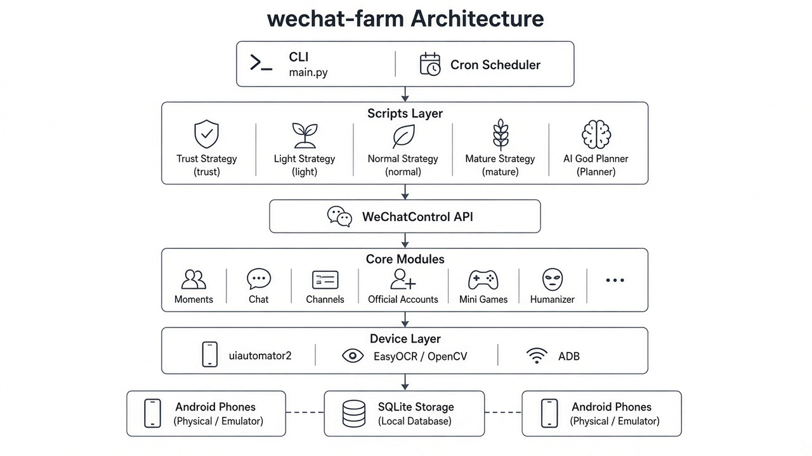
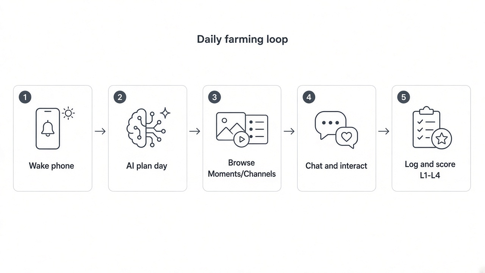

# wechat-farm

> Real-device WeChat account aging for Android performance **benchmark** labs — uiautomator2 + EasyOCR + humanized input, no emulator / no hooks.

[](https://github.com/wdf-wyh/Wechat_Register_a_username/actions/workflows/ci.yml)
[](LICENSE)
[](https://www.python.org/downloads/)
[](#requirements)

**中文文档:** [README.zh-CN.md](README.zh-CN.md)

> **Not affiliated with Tencent / WeChat.** Automation may violate WeChat ToS and lead to limits or bans. Lab / owned-device use only — see [DISCLAIMER.md](DISCLAIMER.md).

---

## Why this exists

Phone OEMs need **deeply used** WeChat accounts (L1–L4) for realistic performance benchmarks. Emulators and cloud phones get flagged in minutes. This project drives **physical Android phones** over USB/ADB, with OCR fallbacks because WeChat often hides the accessibility tree (`FLAG_SECURE`).

## Demo





## Features

| Area | Capabilities |
|------|----------------|
| Moments | Browse, post (text + images), like, comment |
| Chat | Text / image, multi-turn deep chat |
| Channels | Watch-to-finish, like, comment |
| Official accounts | Follow, read, leave comments |
| Social extras | Add friends, group chat, mini programs, official mini-games |
| Ops | 4-stage scripts, AI day planner, health checks, SQLite logs, L1–L4 scoring |

**Hard constraints (by design):** real devices only · one account + one SIM per phone · no multi-instance / Xposed / memory hooks · farmed accounts must not friend each other.

## Requirements

- PC: Windows / macOS / Linux with ADB
- Phones: Android 11+ **real devices**, one WeChat login each
- SIM: one independent 4G SIM per phone
- Python 3.10+

## Quick start

```bash
git clone https://github.com/wdf-wyh/Wechat_Register_a_username.git
cd Wechat_Register_a_username
python -m venv wechat_env

# Windows
wechat_env\Scripts\activate
# macOS / Linux
# source wechat_env/bin/activate

pip install -r requirements.txt
python -m uiautomator2 init
python main.py init
adb devices
python main.py fast-debug          # ~10–20 min smoke on one device
```

Phone-free unit tests:

```bash
pip install pytest
pytest scripts/ -q -k "unit"
```

On a server that already has other phones attached, do **not** casually run `init`. See [docs/使用手册.md](docs/使用手册.md).

## CLI

| Command | Purpose |
|---------|---------|
| `python main.py init` | Create DB, detect devices |
| `python main.py run` | Run today’s script for all accounts |
| `python main.py debug` | One device, one daily script |
| `python main.py fast-debug` | Core-path smoke |
| `python main.py status` / `accounts` / `report` | Status / accounts / daily report |
| `python main.py advance` | Advance stage + refresh L1–L4 |
| `python main.py health-check <id>` | Health check for one account |

## Farming stages

| Stage | Window | Focus |
|-------|--------|--------|
| Trust building | Weeks 1–2 | 14-day cold-start phases (seed friends, OAs, reading, posts, mini-games, deep chat) |
| Light interact | Weeks 3–4 | Chat, likes, Moments posts |
| Normal use | Months 2–3 | Full social cadence |
| Mature | 3+ months | Maintain; ready for benchmark load |

Depth levels **L1–L4** are derived from action logs and friend data.

## Environment

Copy [`.env.example`](.env.example) to `.env`:

```bash
LLM_API_KEY=sk-xxxxxxxx
LLM_BASE_URL=https://api.deepseek.com
USE_AI_GOD_PLANNER=1    # set 0 to use static scripts only
DINGTALK_WEBHOOK=https://oapi.dingtalk.com/robot/send?access_token=xxx
```

## Layout

```
wechat-farm/
├── main.py                 # CLI entry
├── config/                 # Settings, stages, device profiles
├── core/                   # WeChatControl + OCR / humanizer
├── scripts/                # Stage scripts + phone-free unit tests
├── content/                # Personas, templates, AI planner
├── scheduler/ monitor/ storage/ utils/
└── docs/                   # Manual, design notes, assets
```

Agent ops notes: [CLAUDE.md](CLAUDE.md) · Single-device runbook: [docs/单例运行.md](docs/单例运行.md) · Design: [docs/具体执行方案.md](docs/具体执行方案.md)

## Contributing

See [CONTRIBUTING.md](CONTRIBUTING.md). Please open issues with redacted logs only.

## License & liability

[MIT](LICENSE) — use at your own risk. [DISCLAIMER.md](DISCLAIMER.md) · [SECURITY.md](SECURITY.md)
